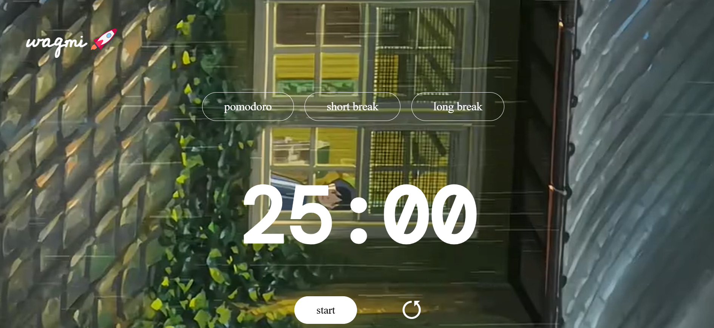

# AthenaFocus ⏳🚀

A minimal, aesthetic, and functional **Pomodoro Timer** app to help you boost productivity and maintain focus using the proven Pomodoro technique.

 <!-- Add your screenshot image in your repo -->

---

## ✨ Features

- 🎯 Pomodoro Mode (25 min)
- ☕ Short Break (5 min)
- 🛌 Long Break (15 min)
- 🔁 Start, Pause, and Reset functionality
- 🔔 Calming notification sound when timer ends
- 🎥 Animated video background for a soothing interface
- 🎨 Clean and modern UI (fully responsive)

---

## 🚀 Tech Stack

- **HTML5**
- **CSS3**
- **JavaScript (Vanilla)**


## 🛠 Setup Instructions

### 1. Clone the repository

```bash
git clone https://github.com/your-username/athenafocus.git
cd athenafocus

2. File Structure

athenafocus/
├── index.html
├── style.css
├── script.js
├── notification.mp3
├── animeVideo.mp4
└── README.md

3. Run the App
You can simply open index.html in your browser.

🧠 Pomodoro Technique
Work for 25 minutes, then take a short 5-minute break.

After every 4 cycles, take a long 15-minute break.

Increases focus, reduces burnout, and helps in deep work.

📦 Contribution
We welcome contributions from the community!

Fork this repo

Create a branch: git checkout -b feature-name

Commit your changes: git commit -m 'Add some feature'

Push to the branch: git push origin feature-name

Submit a pull request ✅